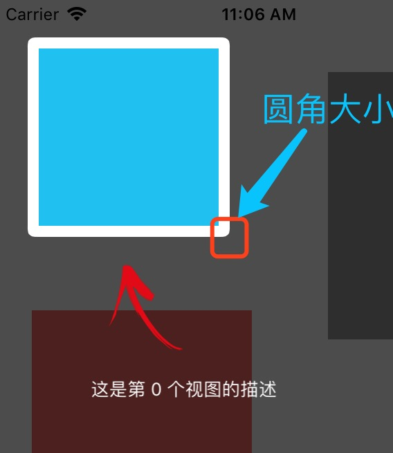
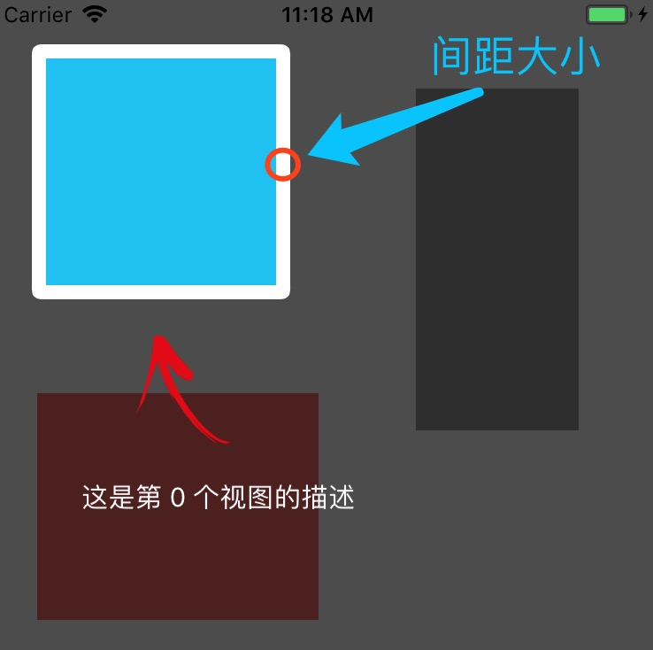
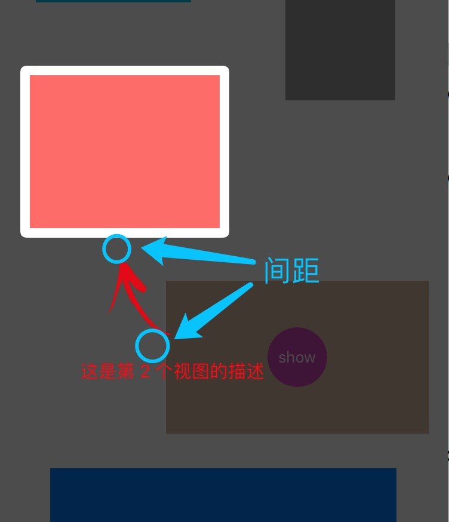

# XCGuideMaskView

[](https://travis-ci.org/fanxiaocong/XCGuideMaskView)
[](https://cocoapods.org/pods/XCGuideMaskView)
[](https://cocoapods.org/pods/XCGuideMaskView)
[](https://cocoapods.org/pods/XCGuideMaskView)
[](https://www.apple.com/nl/ios/)&nbsp;


***
|Author|小小聪明屋|
|---|---|
|E-mail|1016697223@qq.com|
|GitHub|https://github.com/fanxiaocong|
|Blog|http://www.cnblogs.com/fanxiaocong|
***

## Example

自定义新功能引导视图


### 效果图


### 代码

创建视图，设置数据源和布局，并实现相关的方法。

```objc
XCGuideMaskView *maskView = [[XCGuideMaskView alloc] initWithDatasource:self];
maskView.layout = self;
/// 当视图消失之后的回调
maskView.dismissHandle = ^{
	NSLog(@"消失了");
};
[maskView show];
```

#### `XCGuideMaskViewDataSource`&nbsp;数据源方法

`- (NSInteger)numberOfItemsInGuideMaskView:(XCGuideMaskView *)guideMaskView`
需要进行引导的 item 的个数，每个 item 包括三个部份：源视图、描述文字、箭
头


`- (UIView *)guideMaskView:(XCGuideMaskView *)guideMaskView viewForItemAtIndex:(NSInteger)index`
每个 item 中的源视图


`- (NSString *)guideMaskView:(XCGuideMaskView *)guideMaskView descriptionForItemAtIndex:(NSInteger)index`
每个 item 中的描述文字


`- (UIColor *)guideMaskView:(XCGuideMaskView *)guideMaskView colorForDescriptionAtIndex:(NSInteger)index`
描述文字的颜色


`- (UIFont *)guideMaskView:(XCGuideMaskView *)guideMaskView fontForDescriptionAtIndex:(NSInteger)index`
描述文字的字体


#### `XCGuideMaskViewLayout`&nbsp;布局协议方法

`- (CGFloat)guideMaskView:(XCGuideMaskView *)guideMaskView cornerRadiusForViewAtIndex:(NSInteger)index`
item 中源视图对应的圆角大小




`- (UIEdgeInsets)guideMaskView:(XCGuideMaskView *)guideMaskView insetForViewAtIndex:(NSInteger)index`
item 中源视图与蒙板的边距




`- (CGFloat)guideMaskView:(XCGuideMaskView *)guideMaskView spaceForItemAtIndex:(NSInteger)index`
源视图、箭头、描述文字之间的间距




`- (CGFloat)guideMaskView:(XCGuideMaskView *)guideMaskView horizontalInsetForDescriptionAtIndex:(NSInteger)index`
描述文字与左右边框间的距离，如果文字的宽度小于当前可视区域的宽度（源视图的宽度+边距），则会相对于箭头图片居中对齐


## Installation

### CocoaPods
```objc
pod 'XCGuideMaskView'
```